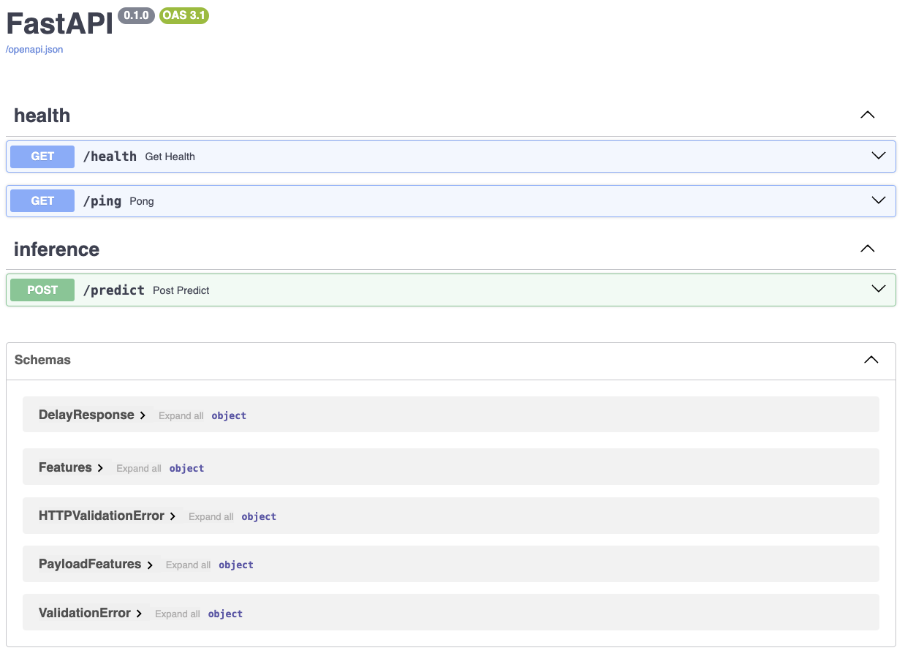
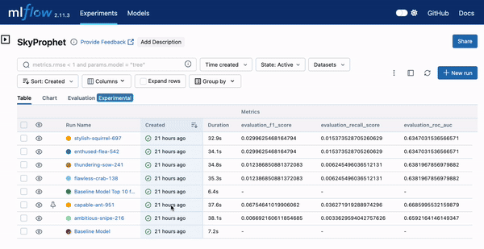

# Sky Prophet <!-- omit in toc -->

[](https://github.com/UribeAlejandro/SkyProphet/actions/workflows/ci.yml)

[](https://github.com/UribeAlejandro/SkyProphet/actions/workflows/cd.yml)

This project is part of the interviewing process for the position of Machine Learning Engineer. The goal of the project is to build a build, test & serve a Machine Learning model able to predict the likelihood of flight delays.

## Table of Contents <!-- omit in toc -->

- [Architecture](#architecture)
- [Installation](#installation)
- [Usage](#usage)
- [Test](#test)
- [Data](#data)
  - [Data Version Control](#data-version-control)
  - [Extract, transform, load](#extract-transform-load)
- [Model](#model)
  - [Experiments](#experiments)
    - [Tracking \& Registry](#tracking--registry)
    - [Serving](#serving)
- [Deployment](#deployment)
- [Nice Things to Have](#nice-things-to-have)
  - [Monitoring](#monitoring)
  - [CI/CD](#cicd)

## Architecture

The architecture of the project is shown below:


## Installation

To install the project, you need to clone the repository and install the dependencies. To install the dependencies, you need to run the following command:

```bash
make install
```

## Usage

To run the server locally you need to run the following command:

```bash
make run-server
```

To run the server using docker you need to run the following command:

```bash
docker build -t skyprophet .
docker-compose up -d
```

You should be able to access the server at `http://localhost:8000`. The documentation of the API is available at `http://localhost:8000/docs`.

The `/docs` route is shown below:



## Test

There are three types of tests in the project:
- `API test`: tests all the endpoints of the API.
- `Model test`: tests the model using a sample dataset.
- `Stress test`: tests the performance of the server.

You can run the tests using the following commands:

```bash
make api-test
make model-test
make stress-test
```

Once finished you can see the results of the test within the reports' folder. You will find: `reports/coverage/index.html` and `reports/stress/index.html`.

## Data

The data is stored in the `datasets` folder. The data is stored in the following format:

```
datasets
├── test
│   └── ...
├── raw
│   └── ...
├── interim
│   └── ...
└── processed
    └── ...
```

The `raw` folder contains the raw data. The `interim` folder contains the data after it has been cleaned. The `processed` folder contains the data after it has been processed and is ready for use in a model. The `test` folder contains the data used for testing.


### Data Version Control

The data is versioned using `DVC`. The data is stored in a remote GCP bucket. It works like git, its commands are similar. For instance, the data stored in `datasets` can be added using the following command:

```bash
dvc add data/
```

Then, the data can be pushed to remote using the following command:

```bash
dvc push
```

The data can be pulled from remote using the following command:

```bash
dvc pull
```

### Extract, transform, load

The ETL process consists of the following steps:

- `extract`: Reads the file `data/raw/data.csv`.
- `transform`: Cleans the data and generates features.
- `load`: Saves the data in `data/processed/data.csv`.

## Model

### Experiments

All the experiments were tracked using `MLFlow`, the tracking server runs in a `GCP VM`, that stores the artifacts (model, confusion matrix, etc) in a `GCP bucket` and the `registry` (metrics, parameters, registered models, etc) in a `PostgreSQL` database that is hosted in `GCP SQL`. A diagram of the architecture is shown below:


As mentioned above, were tracked using `MLFlow`. The tracking server can be started using the following command:

```bash
mlflow server --backend-store-uri $BACKEND_STORE_URI --default-artifact-root $DEFAULT_ARTIFACT_ROOT  --host 0.0.0 --port 5000
```

> Note: You should SSH the `GCP VM` to run the command.

#### Tracking & Registry

The `MLFlow` server allows the data practitioner to track the experiments and register the models. An example of the experiments is shown below:


Once, the model is trained, it can be registered in the `MLFlow` registry. An example of the registry is shown below:



> **Note**: In this case, `capable-ant-951` has been selected as the best model. Because has the highest `F1-score`, `ROC AUC` & `Recall` .


#### Serving

The model is served using `FastAPI`. The model can be served using the following command:

```bash
make run-server
```

The api has the following endpoints:

- `/`: (GET) Greets the user.
- `/predict`: (POST) Predicts the likelihood of a flight delay.
- `/docs`: (GET) Shows the documentation of the API.
- `/health`: (GET) Checks the health of the server.
- `/ping`: (GET) Pings the server.

## Deployment

The deployment of the project is done using `GitHub Actions`. The deployment process consists of the following steps:

- `Continuous Integration`
  - `Build`: Install the dependencies & enforces code style.
  - `Test`: Runs the tests of the project.
- `Continuous Delivery`
  - `Staging`: Build the docker image and push it to the `Container Registry` & `Artifact Regidstry`.
  - `Deploy`: Deploys the created docker image to `GCP Cloud Run` using `Docker`.

The deployed application is shown below:


> **Note:** The model that runs in the `GCP Cloud Run` is the one that has the best performance in the `MLFlow` registry. However, it is not static. Because it is retrieved from the `MLFlow` registry, it can be updated with a new model that has better performance without the need to redeploy the application.

An example of a model promotion is shown below:


> **Note**: The model with the `production` alias is the one that is retrieved by the `GCP Cloud Run`.

## Nice Things to Have

### Monitoring

The monitoring of `SkyProphet` can be done using an adversarial approach. Thus, a second model `adversarial validator` is trained to detect the drift in the data. The architecture of the monitoring system is shown below:


### CI/CD

The actual `CI/CD` runs in `GitHub Actions`, a demanding task such as the `stress-test` is running there, which is not ideal. Then, would be nice to have a `dev` or `test` environment to carry out all tests and deploy in this environment before deploying to `production`.
